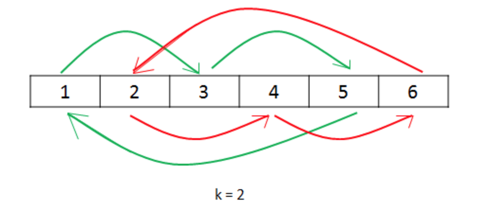

## 189. Rotated Array (Not Finished)
Rotate an array of n elements to the right by k steps.

    For example, with n = 7 and k = 3, the array [1,2,3,4,5,6,7] is rotated to [5,6,7,1,2,3,4].

Note:
Try to come up as many solutions as you can, there are at least 3 different ways to solve this problem.

**Hint:**
**Could you do it in-place with O(1) extra space?**

Related problem: Reverse Words in a String II

** Solution 1: Using Reverse**

    class Solution(object):
        def rotate(self, nums, k):
            """
            :type nums: List[int]
            :type k: int
            :rtype: void Do not return anything, modify nums in-place instead.
            """
            nums.reverse()
            if k > len(nums):
                 k %= len(nums)
            nums[:k] = reversed(nums[:k])
            nums[k:] = reversed(nums[k:])

** Note:**
1. k can be greater than the length of the list, for example:
       if k = 3, nums = [1, 2]
       return: [2, 1],
instead of [1, 2] if ``k %= len(nums)`` doesn't count in.
2. Time Complexity: O(N) and Space Complexity: O(1).
      
** Solution 2: Using Extra Array:**

    class Solution(object):
        def rotate(self, nums, k):
            """
            :type nums: List[int]
            :type k: int
            :rtype: void Do not return anything, modify nums in-place instead.
            """
            l = [None] * len(nums)
            for i in xrange(len(nums)):
                l[(i+k)%len(nums)] = nums[i]
            for i in range(len(nums)):
                nums[i] = l[i]
**Note:**
1. Initialize a list with certain length: `` [None]*len(nums)``
2. Time Complexity: O(N) and Space Complexity: O(N)

** Solution 3: Using Cyclic Replacements: **

This one is a bit triky: but TC will be O(N) and SC will be O(1).

