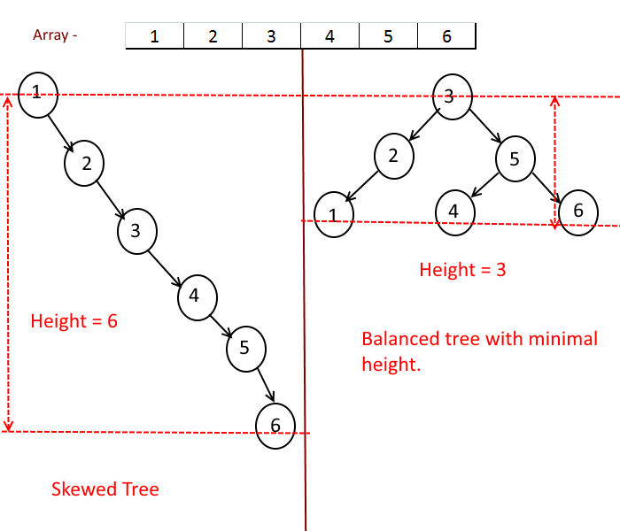
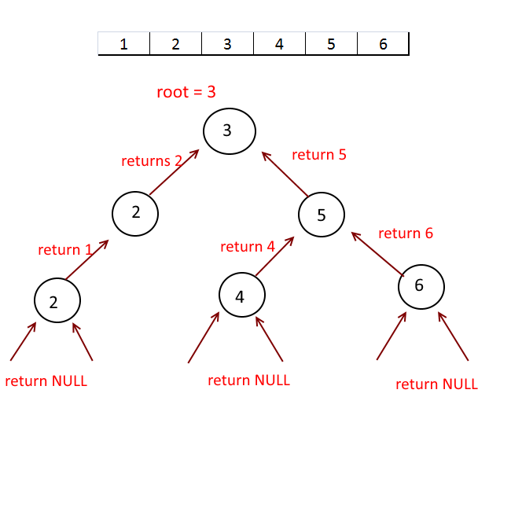

## Minimal Height Tree

Given a sorted array with unique elements, create a binary search tree with minimal height.

**Why minimal height is important :**

We can do the linear scan to the array and make the first element as root and insert all other elements into the tree but in that case tree will be skewed , which means all the nodes of the tree will be on the one side of the root so the height of the tree will be equal to the number of elements in the array. 

**So here our objective is to keep the tree balanced as much as possible.**
 
Cited from: http://algorithms.tutorialhorizon.com/sorted-array-to-binary-search-tree-of-minimal-height/

**Approach:**

Recursion:
1. Get the middle of the array
2. Make it as root. (By doing this we will ensure that half of the elements of array will be on the left side of the root and half on the right side.)
3. Take the left half of the array, call recursively and add it to root.left.
4. Take the right half of the array, call recursively and add it to root.right.
5. return root.

---
** Solution: **

    class ListNode(object):
        def __int__(self):
            self.val = None
            self.left = None
            self.right = None
    
    class Solution(object):
        def sortedArrayToBST(self, nums):
            """
            :type nums: List[int]
            :rtype: TreeNode
            """
            if nums == []:
                return None
            mid = len(nums)/2
            root = TreeNode(nums[mid])
            root.left = self.sortedArrayToBST(nums[:mid])
            root.right = self.sortedArrayToBST(nums[mid+1:])
            return root
